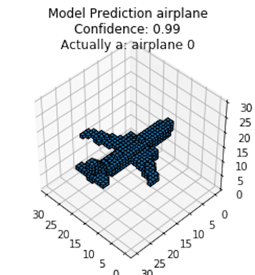
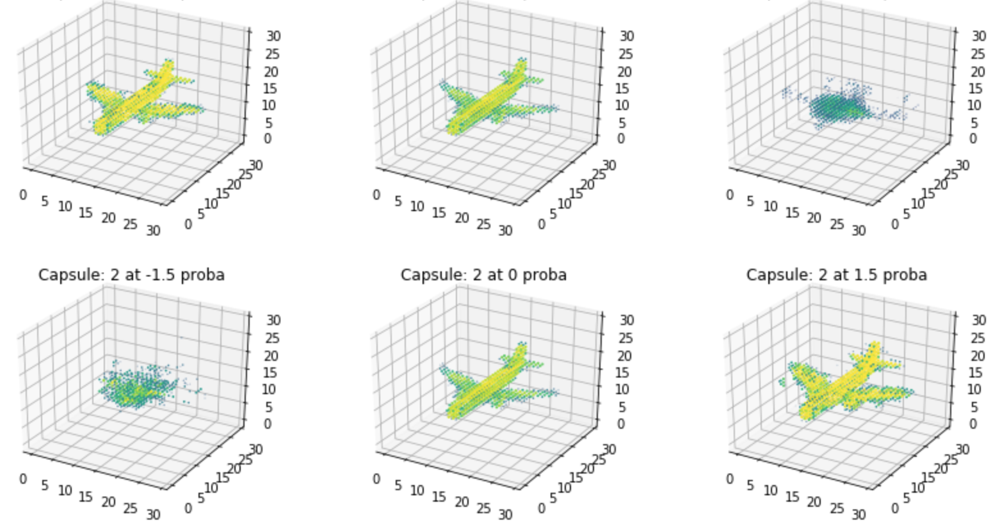

# Capsule Nets for Content Based 3D Model Retrieval
First (as far as I know) investigation of the use of Capsule Networks for content-based 3d model retrieval. (information retrieval for 3D models)

This project was accomplished in just under 4 weeks. I probably used 120 hours of total compute time split between single GPU and 8 GPU aws instances (ModelNet40 takes FOREVER to train!). The final reported accuracies are Stratified 5-Fold cross validated.


|   |    |
|:----------------:|:-----------------:|
|  |  |

## Paper
[Content-Based 3D Model Retrieval](Content%20Based%203d%20Model%20Retrieval.pdf)

## Results
|   | ModelNet10 |   | ModelNet40 |   |
| -------- | ---------- | -------- | ---------- | -------- |
|     | Score | 2xStderr | score      | 2xStderr |
| Accuracy | 93.08% | 1.18% | 82.73% | 2.12% |
| Mean Average Precision | 88.44% | 4.15% | 70.10% | 2.22% |


#### *Cleaning up as we speak
this code has gotten pretty messy in the last week and I'm in the middle of cleaning it up. Please bare with me. 

## Setup

**Download the data**

```
cd 3d_model_retriever/
wget http://vision.princeton.edu/projects/2014/3DShapeNets/ModelNet10.zip
unzip ModelNet10.zip
wget http://modelnet.cs.princeton.edu/ModelNet40.zip
unzip ModelNet40.zip
```

    
**Install binvox binary**

In the root of the project

- MACOSX install:

```
    wget http://www.patrickmin.com/binvox/mac/binvox\?rnd\=1520896803665325 -O binvox
    chmod 755 binvox
```
- Linux install:

```
    wget http://www.patrickmin.com/binvox/linux64/binvox?rnd=1520896952313989 -O binvox
    chmod 755 binvox
```
    
**Make env**

```
cd 3d_model_retriever
python3 -m venv .env
source .env/bin/activate
pip install -r mac_requirements.txt
```
    
**Convert all &ast;.off files to &ast;.binvox**

```
python binvox_convert.py ModelNet10/ --remove-all-dupes
python binvox_convert.py ModelNet40/ --remove-all-dupes
```     

**Additional Notes**

*.off files

Processing *.off files is done by a 3rd party tool made by Patrick Min.

- https://www.patrickmin.com/binvox/

What the hell is an *.off file?

- http://segeval.cs.princeton.edu/public/off_format.html

Voxel Resolution

- http://vision.princeton.edu/projects/2014/3DShapeNets/paper.pdf

"To study 3D shape representation, we propose to represent
a geometric 3D shape as a probability distribution of
binary variables on a 3D voxel grid. Each 3D mesh is represented
as a binary tensor: 1 indicates the voxel is inside the
mesh surface, and 0 indicates the voxel is outside the mesh
(i.e., it is empty space). The grid size in our experiments is
30 × 30 × 30."

```
./binvox -cb -e -c -d 30 sample.off
```

- -e  is important, with a lot of troubleshooting it was shown that not using this led to inconsistent voxelization :headache:
        
** *Viewing .binvox data for troubleshooting* **

```
./viewvox <filename>.binvox
```
        
## Load The Data in Python

```
from data import load_data
(x_train, y_train), (x_test, y_test), target_names = load_data('./ModelNet10')
```
